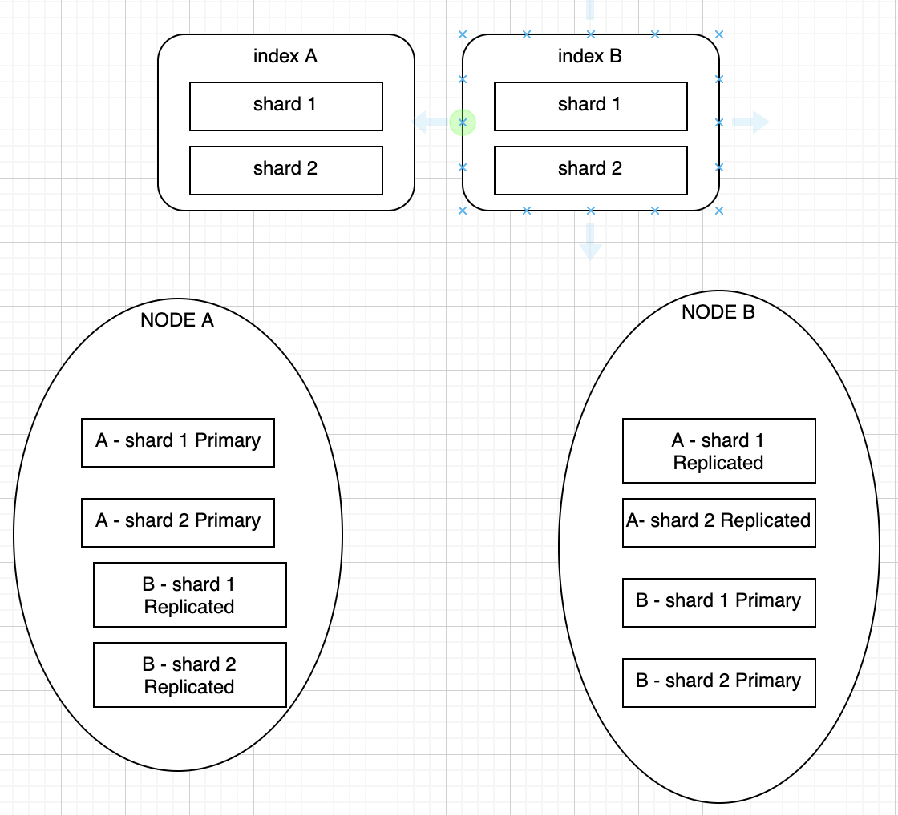

# learning-elk
Repo to contain elk learning notes

## Basics
### What is ELK?
* ELK aka Elastic Search - Logstash - Kibana
* Elastic search is a json data base, no sql.
   * We communicate with es via rest calls.
   * Elastic search's equivalent to RDBMS

        | ES| RDBMS |
        |---|---| 
        |Index | Data Base|
        | Document | Table|
        |Fields | Columns|
    * Query DSL is the language for query in ES DB.

* Logstash is a ingestion pipeline for ES db.
* Kibana is the visualization engine for data in ES db.

### What is Xpack?
* Additional tools for elk
* Elastic sql is a popular tool which can convert sql into Query DSL.

### Architecture overview
* Elastics has clusters.
* Cluster contains -> nodes. 
* Node stores data.
* Cross cluster search is not common/ cross cluster quries are costly(Computer + Network I/O). 
* Cluster must contain logical group of data.
* Unit of data -> document / json objects.
* Documents are grouped into indices. 

### Sharding
* Dividing the data into multiple pieces.
* Index is divided into multiple shards.
* Each shards are saved in different nodes based on the capacity. 
* A node can contain shards of multiple indices.
* Running parallel queries on different shards is also possible to enhance speed.
* Long story short - > **Elastic Enables horizontal scaling via sharding.**

### Replication
* Replication is index level.
* When we divide the index into multiple shards.
* If replication is enabled, shards are duplicated.
* Here is the example:

* Primary _shard_ + replicated _shards_ is called replication group.
* Replication enabled high availability.
* CPU parallel ops improve performance, if multiple replication shards are saved in a node.

### Snapshot
* It's a backup before applying changes.
* To recover the previous state of data. 
